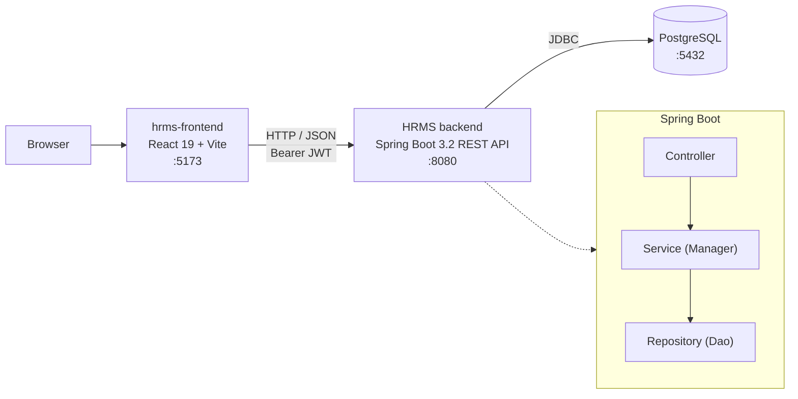

# HRMS — Job Board Backend

A role-based job board (an applicant-tracking style HRMS) built with Spring Boot. Two kinds of users register — **Job Seekers** and **Employers**. Employers post job advertisements and review applications; job seekers build a résumé (experience, education, skills, languages), browse active postings, and apply. Authentication is stateless JWT; the database schema is versioned with Flyway.

This repository is the **backend**. The React frontend lives in a separate repository: [hrms-frontend](https://github.com/kamiltuncok/hrms-frontend).

## Architecture



- **Stateless JWT auth** — no server-side sessions; each request carries a `Bearer` token.
- **Flyway migrations** — schema is created and evolved through versioned SQL scripts (`src/main/resources/db/migration`, `V1`–`V11`).
- **Layered structure** — `Controller → Service (interface + Manager impl) → Repository (Spring Data JPA)`, with MapStruct handling entity ↔ DTO mapping and a standardized `Result`/`DataResult` response wrapper.

## Tech Stack

| Layer | Technologies |
|-------|--------------|
| **Backend** | Java 21, Spring Boot 3.2.4 (Web, Data JPA, Validation, Security, Mail), JWT (jjwt 0.12.5), MapStruct 1.5.5, Bucket4j 8.10.1, Lombok |
| **Frontend** | React 19, Vite 7, TypeScript, React Router 7, Zustand, TanStack Query, Tailwind CSS, Radix UI / shadcn, react-hook-form + Zod, axios — see [hrms-frontend](https://github.com/kamiltuncok/hrms-frontend) |
| **Infra / Data** | PostgreSQL, Flyway (schema migrations), Cloudinary (media uploads), SMTP (transactional mail), springdoc-openapi (API docs), Maven |

## Key Features

- **JWT authentication** with BCrypt (strength 12) password hashing and account lockout after repeated failed logins (`failedAttempts` / `lockTime`).
- **Rate limiting** on authentication endpoints via Bucket4j (e.g. login capped at 10 requests/minute per IP).
- **Security headers** configured in Spring Security: Content-Security-Policy, HSTS (1 year, includeSubDomains), and `X-Frame-Options: DENY`.
- **File uploads** handled through a Cloudinary adapter plus local disk storage for CVs and profile images.
- **Password reset over email** — single-use, time-limited tokens stored as SHA-256 hashes; the raw token is sent only via SMTP.
- **DTO layer with MapStruct** keeps entities decoupled from API request/response shapes.
- **Versioned database schema** with Flyway (`V1`–`V11`).

## API Overview

All endpoints are served under `/api`. The API is documented with springdoc-openapi — once the app is running, open **Swagger UI at `http://localhost:8080/swagger-ui.html`** (OpenAPI JSON at `/v3/api-docs`) for the full, always-current endpoint list.

| Controller group | Base path | Responsibility |
|------------------|-----------|----------------|
| Auth | `/api/auth` | Register (job seeker / employer), login, forgot / reset / validate password-reset token |
| Job Advertisements | `/api/jobadvertisements` | Create, update, delete, list, filter active postings, change status |
| Job Applications | `/api/jobapplications` | Apply to a posting, list by job seeker or employer, update application status |
| Job Seekers | `/api/jobseekers` | Job seeker profile CRUD |
| Employers | `/api/employers` | Employer / company profile CRUD |
| Résumés | `/api/resumes` | Résumé CRUD, CV upload / download, profile photo upload |
| Résumé sub-resources | `/api/jobexperiences`, `/api/schools`, `/api/skills`, `/api/languages` | Manage experience, education, skills and languages on a résumé |
| Reference data | `/api/categories`, `/api/jobtitles`, `/api/cities`, `/api/typeofwork` | Lookup data for postings and filters |
| Files & Photos | `/api/files`, `/api/photos` | Profile image and media uploads |
| Users | `/api/users` | Generic user lookup |

## Getting Started

### Prerequisites

- **JDK 21**
- **Node.js** (18+) and npm — for the frontend
- **PostgreSQL** running locally, with a database named `HRMS`

### 1. Configuration

Secrets are read from environment variables; the real `application.properties` is git-ignored. Copy the template and/or export the variables below:

```bash
cp src/main/resources/application-example.properties src/main/resources/application.properties
```

| Variable | Required | Purpose |
|----------|----------|---------|
| `DB_PASSWORD` | yes | PostgreSQL password |
| `DB_URL` | no | JDBC URL (default `jdbc:postgresql://localhost:5432/HRMS`) |
| `DB_USERNAME` | no | DB user (default `postgres`) |
| `JWT_SECRET` | yes | JWT signing key, ≥ 256 bits (e.g. `openssl rand -hex 32`) |
| `MAIL_USERNAME` | for email | SMTP username (password-reset emails) |
| `MAIL_PASSWORD` | for email | SMTP app password |
| `FRONTEND_URL` | no | Base URL used in reset links (default `http://localhost:5173`) |

### 2. Run the backend

```bash
# Windows (PowerShell)
$env:JAVA_HOME = 'C:\Program Files\Java\jdk-21'
.\mvnw.cmd spring-boot:run

# macOS / Linux
./mvnw spring-boot:run
```

The API starts on **http://localhost:8080**. Flyway applies migrations on startup.

### 3. Run the frontend

In the [hrms-frontend](https://github.com/kamiltuncok/hrms-frontend) repository:

```bash
npm install
npm run dev
```

The dev server starts on **http://localhost:5173** (the origin allowed by the backend's CORS config).

### Run both with one command (Windows)

From the parent folder that contains both `HRMS` and `hrms-frontend`, `run_hrms.ps1` frees port 8080, then launches the backend and frontend in separate PowerShell windows:

```powershell
.\run_hrms.ps1
```

## Screenshots

<!-- TODO: add screenshots of the job search, job detail, application, and profile pages -->

_[TODO] Screenshots to be added._
