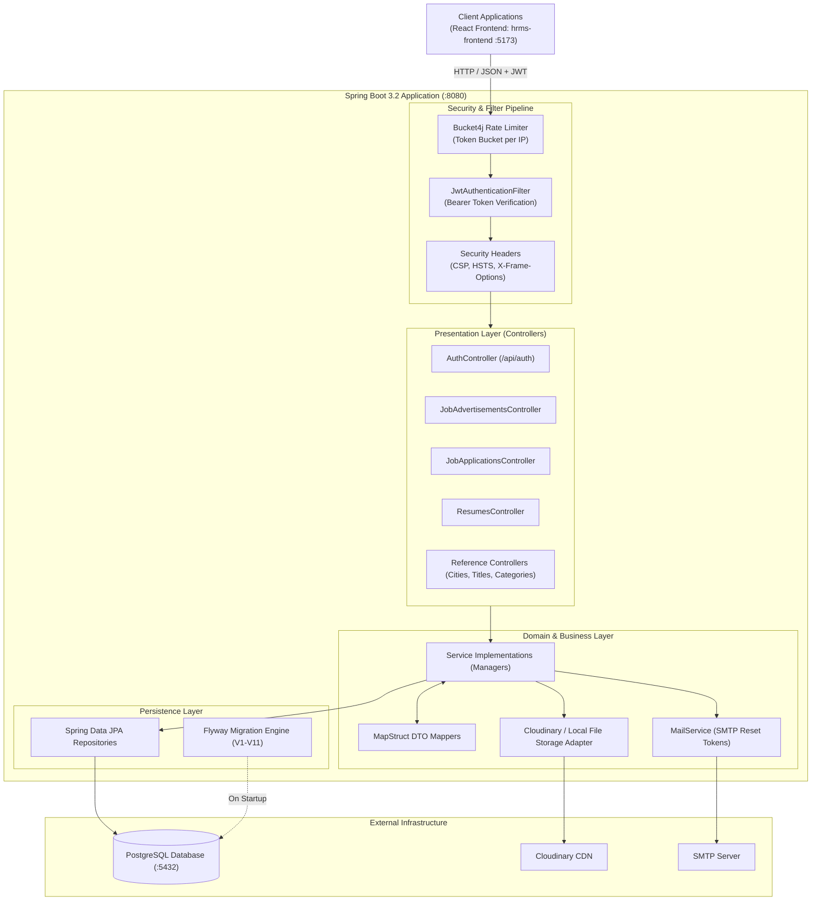
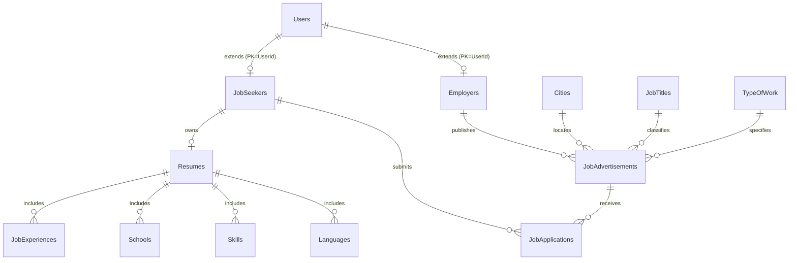

# HRMS — Role-Based Recruitment & Applicant Tracking Backend

A robust, enterprise-grade RESTful backend for a role-based Human Resource Management & Applicant Tracking System (ATS) built with **Java 21** and **Spring Boot 3.2**. The platform supports dual user domains (**Job Seekers** and **Employers**): employers publish and manage job advertisements and evaluate incoming applications, while job seekers build comprehensive CV profiles (work experience, education, technical skills, languages, profile media) and submit job applications.

This repository is the **backend service**. The companion React frontend is located in [hrms-frontend](https://github.com/kamiltuncok/hrms-frontend).

---

## Recruiter & Engineering Summary

- **Primary Stack**: Java 21, Spring Boot 3.2.4 (Spring Data JPA, Spring Security, Spring Mail, Spring Validation), PostgreSQL, Flyway, JWT (jjwt 0.12.5), MapStruct 1.5.5, Bucket4j 8.10.1, SpringDoc OpenAPI.
- **Key Engineering Highlights**: Strict N-tier modular architecture (`Controller → Service / Manager → Repository`), Flyway version-controlled schema migrations (`V1`–`V11`), decoupled entity-DTO layer via compile-time MapStruct mappers, defensive security measures (IP rate limiting with token buckets, account lockout policies, SHA-256 hashed password reset tokens, BCrypt strength 12), and dual-mode file storage (Cloudinary + local filesystem fallback).
- **Primary Technical Challenge**: Designing a flexible resume and multi-step application workflow with granular access controls, transactional integrity, and hardened authentication endpoints resilient against brute-force attacks.

---

## System Architecture


```mermaid
flowchart TD
    Client["Client Applications<br/>(React Frontend: hrms-frontend :5173)"]
    
    subgraph SpringBootApp ["Spring Boot 3.2 Application (:8080)"]
        subgraph SecurityFilter ["Security & Filter Pipeline"]
            RateLimit["Bucket4j Rate Limiter<br/>(Token Bucket per IP)"]
            JwtFilter["JwtAuthenticationFilter<br/>(Bearer Token Verification)"]
            SecHeaders["Security Headers<br/>(CSP, HSTS, X-Frame-Options)"]
        end
        
        subgraph APIControllers ["Presentation Layer (Controllers)"]
            AuthController["AuthController (/api/auth)"]
            JobAdvController["JobAdvertisementsController"]
            ApplicationController["JobApplicationsController"]
            ResumeController["ResumesController"]
            RefControllers["Reference Controllers (Cities, Titles, Categories)"]
        end
        
        subgraph ServiceLayer ["Domain & Business Layer"]
            Managers["Service Implementations (Managers)"]
            Mappers["MapStruct DTO Mappers"]
            EmailService["MailService (SMTP Reset Tokens)"]
            FileStorage["Cloudinary / Local File Storage Adapter"]
        end
        
        subgraph DataLayer ["Persistence Layer"]
            Repositories["Spring Data JPA Repositories"]
            Flyway["Flyway Migration Engine (V1-V11)"]
        end
    end
    
    subgraph ExternalServices ["External Infrastructure"]
        Postgres[("PostgreSQL Database (:5432)")]
        CloudinaryAPI["Cloudinary CDN"]
        SmtpServer["SMTP Server"]
    end

    Client -->|HTTP / JSON + JWT| RateLimit
    RateLimit --> JwtFilter
    JwtFilter --> SecHeaders
    SecHeaders --> APIControllers
    APIControllers --> Managers
    Managers <--> Mappers
    Managers --> Repositories
    Managers --> EmailService
    Managers --> FileStorage
    Repositories --> Postgres
    Flyway -.->|On Startup| Postgres
    EmailService --> SmtpServer
    FileStorage --> CloudinaryAPI
```

---

## Key Features & Technical Highlights

### 1. Hardened Authentication & Defensive Security
- **Stateless JWT Authorization**: Requests are authenticated via standard `Bearer` tokens signed with HMAC-SHA algorithms.
- **Brute-Force & Denial-of-Service Protection**: Sensitive authentication routes are protected by **Bucket4j** rate limiting (e.g. login capped at 10 requests/minute per client IP).
- **Account Lockout Policy**: Tracks consecutive failed login attempts (`failedAttempts`) and enforces temporary account locks (`lockTime`) to mitigate credential stuffing.
- **Secure Password Reset Loop**: Implements single-use, time-limited reset tokens stored exclusively as SHA-256 hashes in the database; raw tokens are delivered solely via transactional SMTP emails.
- **Password Encryption**: Password hashing utilizing **BCrypt** with an elevated work factor (strength 12).
- **HTTP Security Headers**: Configured Content-Security-Policy (CSP), Strict-Transport-Security (HSTS), and `X-Frame-Options: DENY`.

### 2. Versioned Database Schema with Flyway
- Schema changes are managed declaratively through versioned SQL migration scripts located in `src/main/resources/db/migration/` (`V1` through `V11`).
- Eliminates schema drift across development, CI/CD, and production environments without relying on error-prone runtime ORM auto-generation.

### 3. Clean DTO Separation via MapStruct
- Complete isolation between internal JPA database entities and external REST API payloads.
- Compile-time generated **MapStruct** mappers ensure zero-reflection performance and type-safe data transformations.

### 4. Media & Document Management
- Pluggable media upload architecture supporting **Cloudinary** cloud CDN uploads alongside local filesystem storage for applicant résumés, documents, and profile avatars.

### 5. Standardized Response & Exception Handling
- Unified response contracts across all endpoints using `Result`, `DataResult<T>`, `SuccessDataResult<T>`, and `ErrorDataResult<T>`.
- Centralized `GlobalExceptionHandler` intercepting validation errors (`MethodArgumentNotValidException`), domain business exceptions, and security access violations.

---

## Technology Stack

| Category | Technologies |
|---|---|
| **Runtime & Framework** | Java 21, Spring Boot 3.2.4 |
| **Persistence & Data** | Spring Data JPA (Hibernate), PostgreSQL, Flyway Migration Engine |
| **Security & Auth** | Spring Security 6, JJWT (io.jsonwebtoken 0.12.5), BCrypt, Bucket4j 8.10.1 |
| **Object Mapping** | MapStruct 1.5.5.Final, Project Lombok |
| **Documentation & Mail** | SpringDoc OpenAPI (Swagger UI), Spring Boot Starter Mail (JavaMailSender) |
| **File Storage** | Cloudinary Java SDK, Local Disk Storage Adapter |
| **Build & Tooling** | Maven (Maven Wrapper `mvnw` included) |

---

## Project Structure

```
HRMS/
├── src/main/java/kodlamaio/HRMS/
│   ├── api/controllers/         # REST API Controllers (Auth, Jobs, Applications, Resumes, etc.)
│   ├── business/
│   │   ├── abstracts/           # Service layer contracts (IJobAdvertisementService, etc.)
│   │   ├── concretes/           # Business managers with domain logic
│   │   ├── constants/           # Business exception and response messages
│   │   ├── dtos/                # Request / Response Data Transfer Objects
│   │   └── mappers/             # MapStruct mapper interfaces
│   ├── core/
│   │   ├── adapters/            # Cloudinary & external integration adapters
│   │   ├── exception/           # GlobalExceptionHandler & custom exception types
│   │   ├── security/            # JWT TokenProvider, UserDetails, SecurityConfig, Bucket4j
│   │   └── utilities/results/   # Result, DataResult, Success/Error response structures
│   ├── dataAccess/abstracts/    # Spring Data JPA repository interfaces
│   ├── entities/concretes/      # JPA Entity models (JobSeeker, Employer, JobAdvertisement, etc.)
│   └── HrmsApplication.java     # Spring Boot application entry point
├── src/main/resources/
│   ├── db/migration/            # Flyway versioned SQL migrations (V1__... to V11__...)
│   ├── application.properties   # Main configuration (git-ignored for security)
│   └── application-example.properties # Template configuration with environment placeholders
├── pom.xml                      # Maven project definition & dependencies
└── docker-compose.yml           # PostgreSQL container orchestration
```

---

## API Overview

Interactive Swagger UI documentation is available at `http://localhost:8080/swagger-ui.html` when running locally.

| Controller Group | Base Route | Key Responsibilities |
|---|---|---|
| **Authentication** | `/api/auth` | Job seeker / Employer registration, login, forgot password, token validation, password reset |
| **Job Advertisements** | `/api/jobadvertisements` | Postings CRUD, active postings feed, filter by city/title/employer, status toggling |
| **Job Applications** | `/api/jobapplications` | Apply to vacancies, list applications by candidate or employer, update hiring status |
| **Résumés & Profiles** | `/api/resumes` | Candidate CV generation, biography, GitHub/LinkedIn links, profile photo & PDF upload |
| **Résumé Details** | `/api/jobexperiences`, `/api/schools`, `/api/skills`, `/api/languages` | Granular experience, education, language, and skillset management |
| **User & Employer** | `/api/employers`, `/api/jobseekers`, `/api/users` | Profile administration and company verification |
| **Lookups & Metadata** | `/api/categories`, `/api/cities`, `/api/jobtitles`, `/api/typeofwork` | Standardized reference classification data |

---

## Database & Entity Relationships

The PostgreSQL relational schema features strict foreign key constraints and audit metadata:


```mermaid
erDiagram
    Users ||--o| JobSeekers : "extends (PK=UserId)"
    Users ||--o| Employers : "extends (PK=UserId)"
    
    Employers ||--o{ JobAdvertisements : publishes
    Cities ||--o{ JobAdvertisements : locates
    JobTitles ||--o{ JobAdvertisements : classifies
    TypeOfWork ||--o{ JobAdvertisements : specifies
    
    JobSeekers ||--o| Resumes : owns
    Resumes ||--o{ JobExperiences : includes
    Resumes ||--o{ Schools : includes
    Resumes ||--o{ Skills : includes
    Resumes ||--o{ Languages : includes
    
    JobSeekers ||--o{ JobApplications : submits
    JobAdvertisements ||--o{ JobApplications : receives
```

---

## Getting Started

### Prerequisites

- **Java Development Kit (JDK)**: Version 21
- **PostgreSQL**: Version 14+ running on port `5432` (or via Docker)
- **Maven**: (or use the included `./mvnw` / `mvnw.cmd` wrapper)

### 1. Configuration Setup

Copy the example configuration template:

```bash
cp src/main/resources/application-example.properties src/main/resources/application.properties
```

Configure your environment variables (or update `application.properties` directly):

| Variable | Required | Purpose |
|---|---|---|
| `DB_URL` | No | JDBC Connection URL (default: `jdbc:postgresql://localhost:5432/HRMS`) |
| `DB_USERNAME` | No | PostgreSQL user (default: `postgres`) |
| `DB_PASSWORD` | **Yes** | PostgreSQL password |
| `JWT_SECRET` | **Yes** | Cryptographic 256+ bit secret key for signing JWT tokens |
| `MAIL_USERNAME` | For Reset | SMTP username for outbound transactional emails |
| `MAIL_PASSWORD` | For Reset | SMTP password / App Password |
| `FRONTEND_URL` | No | Base frontend URL for reset links (default: `http://localhost:5173`) |

### 2. Start PostgreSQL via Docker (Optional)

```bash
docker-compose up -d
```

### 3. Build & Run the Backend

```bash
# Windows (PowerShell)
$env:JAVA_HOME = 'C:\Program Files\Java\jdk-21'
.\mvnw.cmd spring-boot:run

# macOS / Linux
./mvnw spring-boot:run
```

The service initializes on `http://localhost:8080`. Flyway automatically runs pending database migrations on startup.

---

## Engineering Decisions & Trade-offs

1. **Flyway Migrations over Hibernate `ddl-auto`**:
   - *Rationale*: Automatic schema generation (`ddl-auto=update`) poses severe data corruption risks in production and lacks rollback tracking. Flyway guarantees repeatable, audited SQL executions across all deployment environments.
2. **Bucket4j In-Memory Token Bucket**:
   - *Rationale*: Prevents brute-force attacks at the application tier without requiring an external Redis infrastructure dependency during early-stage deployments.
3. **MapStruct Compile-Time Mapping over Reflection (e.g. ModelMapper)**:
   - *Rationale*: Reflection-based mappers introduce runtime overhead and fail silently on field name discrepancies. MapStruct generates standard Java code at build time, failing fast during compilation if mapping contracts break.

---

## Known Limitations & Roadmap

- **Distributed Rate Limiting**: The current Bucket4j configuration operates in-memory; scaling across multiple instances requires backed storage (e.g. Redis).
- **Search Optimization**: Filtering job advertisements uses relational database indexes; integrating Elasticsearch or PostgreSQL full-text search would enhance relevance ranking for large-scale catalogues.
- **Automated Integration Test Suite**: Unit and MockMvc test coverage across business managers and controllers is targeted for expansion.
