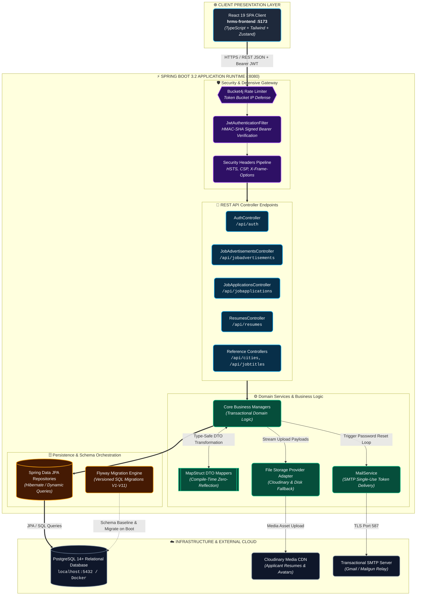
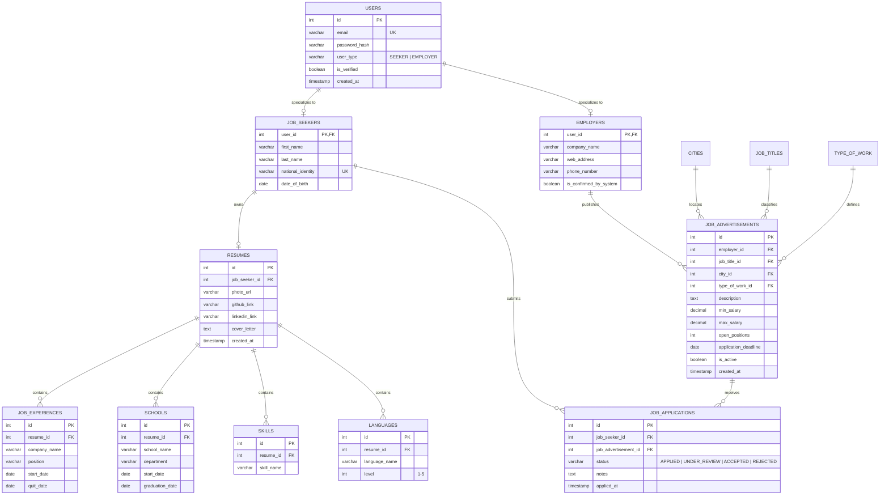

# HRMS — Role-Based Recruitment & Applicant Tracking System Backend

<div align="center">


**An enterprise-grade, role-based RESTful API powering a modern Human Resource Management & Applicant Tracking System (ATS).**

[Live API Docs (Local)](#api-overview--interactive-docs) • [Architecture Guide](#system-architecture) • [Quick Setup](#getting-started--local-setup) • [Frontend Client](https://github.com/kamiltuncok/hrms-frontend)

</div>

---

> ### 📋 GitHub Repository Metadata
> * **Description:** Production-ready Spring Boot 3.2 & Java 21 ATS backend featuring JWT security, Flyway migrations, Bucket4j rate limiting, and dual Cloudinary/disk storage.
> * **Topics:** `java-21`, `spring-boot-3`, `applicant-tracking-system`, `postgresql`, `flyway`, `spring-security`, `jwt`, `bucket4j`, `mapstruct`, `rest-api`

---

## 📖 Executive Summary & Core Value

HRMS Backend is a resilient, secure REST service engineered for dual-domain human resource operations:
* **Job Seekers:** Candidate registration, multi-section interactive CV management (education timelines, workplace experiences, verified technical skills, foreign languages with CEFR grading, and portfolio links), and one-click application submission with status tracking.
* **Corporate Employers:** Employer onboarding, company verification workflows, job advertisement creation with location/salary constraints, and applicant candidate pipeline review.

The system is built on **Java 21** and **Spring Boot 3.2**, enforcing strict N-tier separation of concerns, zero-reflection data mapping, defensive security policies against credential attacks, and automated database schema evolutions.

---

## 🎯 Evaluator Guide: Key Architectural Highlights

If you are an evaluator or technical recruiter reviewing code quality, here are the best starting points:

| Evaluated Concept | Key Implementation Files | Key Takeaway |
|---|---|---|
| **Defensive Security & Rate Limiting** | [`SecurityConfig.java`](file:///c:/Users/MONSTER/OneDrive/Belgeler/GitHub/HRMS/src/main/java/kodlamaio/HRMS/core/security/SecurityConfig.java), [`RateLimitingFilter.java`](file:///c:/Users/MONSTER/OneDrive/Belgeler/GitHub/HRMS/src/main/java/kodlamaio/HRMS/core/security/RateLimitingFilter.java) | Token-bucket IP rate limiting with **Bucket4j**, account lockouts after failed attempts, BCrypt strength 12. |
| **Password Reset Security** | [`AuthManager.java`](file:///c:/Users/MONSTER/OneDrive/Belgeler/GitHub/HRMS/src/main/java/kodlamaio/HRMS/business/concretes/AuthManager.java), [`PasswordResetToken.java`](file:///c:/Users/MONSTER/OneDrive/Belgeler/GitHub/HRMS/src/main/java/kodlamaio/HRMS/entities/concretes/PasswordResetToken.java) | Single-use, time-limited reset tokens stored exclusively as **SHA-256 hashes** in PostgreSQL. |
| **High-Performance DTO Mapping** | `src/main/java/kodlamaio/HRMS/business/mappers/` | Compile-time **MapStruct 1.5.5** mappers eliminating runtime reflection overhead. |
| **Versioned Schema Migrations** | `src/main/resources/db/migration/` (`V1__` through `V11__`) | 11 sequential Flyway SQL migration scripts ensuring repeatable schema transitions across environments. |
| **Unified Result Contracts** | `src/main/java/kodlamaio/HRMS/core/utilities/results/` | Polymorphic `Result`, `DataResult<T>`, `SuccessDataResult<T>`, `ErrorDataResult<T>` envelopes. |

---

## 🏛️ System Architecture


```mermaid
flowchart TB
    %% ================= GLOBAL STYLES =================
    classDef clientStyle fill:#1e293b,stroke:#38bdf8,stroke-width:2px,color:#f8fafc,rx:8,ry:8;
    classDef securityStyle fill:#2e1065,stroke:#a855f7,stroke-width:2px,color:#f8fafc,rx:8,ry:8;
    classDef controllerStyle fill:#082f49,stroke:#0ea5e9,stroke-width:2px,color:#f8fafc,rx:8,ry:8;
    classDef serviceStyle fill:#064e3b,stroke:#10b981,stroke-width:2px,color:#f8fafc,rx:8,ry:8;
    classDef dataStyle fill:#451a03,stroke:#f59e0b,stroke-width:2px,color:#f8fafc,rx:8,ry:8;
    classDef infraStyle fill:#0f172a,stroke:#64748b,stroke-width:2px,color:#f8fafc,rx:8,ry:8;

    %% ================= NODES & SUBGRAPHS =================
    subgraph ClientTier [" 🌐 CLIENT PRESENTATION LAYER "]
        Client["React 19 SPA Client<br/><b>hrms-frontend :5173</b><br/><i>(TypeScript + Tailwind + Zustand)</i>"]:::clientStyle
    end

    subgraph BackendApp [" ⚡ SPRING BOOT 3.2 APPLICATION RUNTIME (:8080) "]
        
        subgraph SecurityPipeline [" 🛡️ Security & Defensive Gateway "]
            RateLimiter{{"Bucket4j Rate Limiter<br/><i>Token Bucket IP Defense</i>"}}:::securityStyle
            JwtFilter["JwtAuthenticationFilter<br/><i>HMAC-SHA Signed Bearer Verification</i>"]:::securityStyle
            SecHeaders["Security Headers Pipeline<br/><i>HSTS, CSP, X-Frame-Options</i>"]:::securityStyle
        end

        subgraph PresentationLayer [" 📡 REST API Controller Endpoints "]
            AuthController["AuthController<br/><code>/api/auth</code>"]:::controllerStyle
            JobAdvController["JobAdvertisementsController<br/><code>/api/jobadvertisements</code>"]:::controllerStyle
            AppController["JobApplicationsController<br/><code>/api/jobapplications</code>"]:::controllerStyle
            ResumeController["ResumesController<br/><code>/api/resumes</code>"]:::controllerStyle
            RefControllers["Reference Controllers<br/><code>/api/cities, /api/jobtitles</code>"]:::controllerStyle
        end

        subgraph BusinessLayer [" ⚙️ Domain Services & Business Logic "]
            Managers["Core Business Managers<br/><i>(Transactional Domain Logic)</i>"]:::serviceStyle
            Mappers[["MapStruct DTO Mappers<br/><i>(Compile-Time Zero-Reflection)</i>"]]:::serviceStyle
            EmailService["MailService<br/><i>(SMTP Single-Use Token Delivery)</i>"]:::serviceStyle
            StorageAdapter["File Storage Provider Adapter<br/><i>(Cloudinary & Disk Fallback)</i>"]:::serviceStyle
        end

        subgraph PersistenceLayer [" 🗄️ Persistence & Schema Orchestration "]
            Repositories[("Spring Data JPA Repositories<br/><i>(Hibernate / Dynamic Queries)</i>")]:::dataStyle
            FlywayEngine["Flyway Migration Engine<br/><i>(Versioned SQL Migrations V1-V11)</i>"]:::dataStyle
        end
    end

    subgraph ExternalInfra [" ☁️ INFRASTRUCTURE & EXTERNAL CLOUD "]
        Postgres[("PostgreSQL 14+ Relational Database<br/><code>localhost:5432 / Docker</code>")]:::infraStyle
        CloudinaryCDN["Cloudinary Media CDN<br/><i>(Applicant Resumes & Avatars)</i>"]:::infraStyle
        SmtpRelay["Transactional SMTP Server<br/><i>(Gmail / Mailgun Relay)</i>"]:::infraStyle
    end

    %% ================= CONNECTIONS =================
    Client ==>|"HTTPS / REST JSON + Bearer JWT"| RateLimiter
    RateLimiter --> JwtFilter
    JwtFilter --> SecHeaders
    SecHeaders ==> PresentationLayer

    PresentationLayer ==> Managers
    Managers <-->|"Type-Safe DTO Transformation"| Mappers
    Managers ==> Repositories
    Managers -->|"Trigger Password Reset Loop"| EmailService
    Managers -->|"Stream Upload Payloads"| StorageAdapter

    Repositories ==>|"JPA / SQL Queries"| Postgres
    FlywayEngine -.->|"Schema Baseline & Migrate on Boot"| Postgres
    EmailService -->|"TLS Port 587"| SmtpRelay
    StorageAdapter -->|"Media Asset Upload"| CloudinaryCDN
```

---

## 🗂️ Project Structure & Architecture Breakdown

```
HRMS/
├── src/main/java/kodlamaio/HRMS/
│   ├── api/controllers/               # REST Presentation Layer: HTTP endpoints & status codes
│   │   ├── AuthController.java        # Registration, login, password recovery, verification
│   │   ├── JobAdvertisementsController.java # Postings CRUD, filtering, employer toggles
│   │   ├── JobApplicationsController.java  # Candidate applications & hiring review
│   │   ├── ResumesController.java     # CV compilation, photo & document uploads
│   │   └── ...                        # Reference controllers (Cities, Titles, Categories)
│   ├── business/                      # Domain & Business Layer
│   │   ├── abstracts/                 # Service contracts and interface specifications
│   │   ├── concretes/                 # Core business manager implementations
│   │   ├── constants/                 # Standardized system, domain, and error messages
│   │   ├── dtos/                      # Inbound request and outbound response data transfer objects
│   │   └── mappers/                   # Compile-time MapStruct mapping interfaces
│   ├── core/                          # Cross-Cutting Infrastructure
│   │   ├── adapters/                  # Cloudinary & local storage media adapters
│   │   ├── exception/                 # GlobalExceptionHandler, Validation & Business exceptions
│   │   ├── security/                  # JWT TokenProvider, SecurityFilterChain, Bucket4j config
│   │   └── utilities/results/         # Result / DataResult polymorphic response models
│   ├── dataAccess/abstracts/          # Spring Data JPA Repository interfaces & JPQL queries
│   ├── entities/concretes/            # JPA Domain entities with relational mapping
│   └── HrmsApplication.java           # Spring Boot application entry point
├── src/main/resources/
│   ├── db/migration/                  # Flyway versioned migration scripts (V1__ to V11__)
│   ├── application.properties         # Runtime local config (git-ignored)
│   └── application-example.properties # Template configuration with environment placeholders
├── pom.xml                            # Maven project build definition & dependencies
└── docker-compose.yml                 # PostgreSQL container definition for instant startup
```

---

## 🗄️ Relational Database & Entity Model


```mermaid
erDiagram
    USERS ||--o| JOB_SEEKERS : "specializes to"
    USERS ||--o| EMPLOYERS : "specializes to"
    
    USERS {
        int id PK
        varchar email "UK"
        varchar password_hash
        varchar user_type "SEEKER | EMPLOYER"
        boolean is_verified
        timestamp created_at
    }

    JOB_SEEKERS {
        int user_id PK,FK
        varchar first_name
        varchar last_name
        varchar national_identity "UK"
        date date_of_birth
    }

    EMPLOYERS {
        int user_id PK,FK
        varchar company_name
        varchar web_address
        varchar phone_number
        boolean is_confirmed_by_system
    }

    EMPLOYERS ||--o{ JOB_ADVERTISEMENTS : "publishes"
    CITIES ||--o{ JOB_ADVERTISEMENTS : "locates"
    JOB_TITLES ||--o{ JOB_ADVERTISEMENTS : "classifies"
    TYPE_OF_WORK ||--o{ JOB_ADVERTISEMENTS : "defines"

    JOB_ADVERTISEMENTS {
        int id PK
        int employer_id FK
        int job_title_id FK
        int city_id FK
        int type_of_work_id FK
        text description
        decimal min_salary
        decimal max_salary
        int open_positions
        date application_deadline
        boolean is_active
        timestamp created_at
    }

    JOB_SEEKERS ||--o| RESUMES : "owns"
    RESUMES ||--o{ JOB_EXPERIENCES : "contains"
    RESUMES ||--o{ SCHOOLS : "contains"
    RESUMES ||--o{ SKILLS : "contains"
    RESUMES ||--o{ LANGUAGES : "contains"

    RESUMES {
        int id PK
        int job_seeker_id FK
        varchar photo_url
        varchar github_link
        varchar linkedin_link
        text cover_letter
        timestamp created_at
    }

    JOB_EXPERIENCES {
        int id PK
        int resume_id FK
        varchar company_name
        varchar position
        date start_date
        date quit_date
    }

    SCHOOLS {
        int id PK
        int resume_id FK
        varchar school_name
        varchar department
        date start_date
        date graduation_date
    }

    SKILLS {
        int id PK
        int resume_id FK
        varchar skill_name
    }

    LANGUAGES {
        int id PK
        int resume_id FK
        varchar language_name
        int level "1-5"
    }

    JOB_SEEKERS ||--o{ JOB_APPLICATIONS : "submits"
    JOB_ADVERTISEMENTS ||--o{ JOB_APPLICATIONS : "receives"

    JOB_APPLICATIONS {
        int id PK
        int job_seeker_id FK
        int job_advertisement_id FK
        varchar status "APPLIED | UNDER_REVIEW | ACCEPTED | REJECTED"
        text notes
        timestamp applied_at
    }
```

---

## ⚡ Key Features & Engineering Highlights

### 1. Robust Authentication & Defensive Security
* **Stateless JWT Flow:** Signed with HMAC-SHA256, validated through custom `JwtAuthenticationFilter`.
* **Bucket4j IP Rate Limiting:** Brute-force mitigation on `/api/auth/*` endpoints (capped at 10 requests/min per IP).
* **Account Lockout Policy:** Protects user accounts after sequential failed attempts (`failedAttempts` & `lockTime`).
* **Hashed Password Reset:** Reset tokens are single-use, time-expiring, and stored as SHA-256 hashes in PostgreSQL; raw tokens are delivered exclusively over TLS-encrypted SMTP.
* **BCrypt Hashing:** High work factor (strength 12) for stored user credentials.

### 2. Schema Evolution via Flyway (V1–V11)
* Completely eliminates schema drift across environments without relying on error-prone ORM auto-generation.
* Sequential migrations configure baseline entities, foreign keys, audit timestamps, and password reset token schemas.

### 3. Unified Error & Exception Handling
* Centralized `GlobalExceptionHandler` intercepting:
  * Bean validation failures (`MethodArgumentNotValidException`) -> Standardized field error lists.
  * Domain exceptions (`UserNotFoundException`, `WeakPasswordException`, etc.) -> Clean error messages.
  * Access denied and rate limit exceptions -> RFC 7807 compliant JSON envelopes.

---

## 🛠️ Technology Stack

| Domain | Technology |
|---|---|
| **Runtime & Framework** | Java 21, Spring Boot 3.2.4 |
| **Data & ORM** | Spring Data JPA, Hibernate, PostgreSQL 14+, Flyway 10 |
| **Security & Auth** | Spring Security 6.2, JJWT 0.12.5, BCrypt, Bucket4j 8.10.1 |
| **Mapping & Productivity** | MapStruct 1.5.5, Lombok |
| **Docs & Validation** | SpringDoc OpenAPI (Swagger UI 3.0), Hibernate Validator |
| **Storage & Mail** | Cloudinary Java SDK, Local Disk Fallback, JavaMailSender |
| **Build & Tooling** | Apache Maven, Maven Wrapper (`mvnw`), Docker Compose |

---

## 🚀 Getting Started & Local Setup

### Prerequisites
* **Java Development Kit (JDK):** Version 21 (Temurin, Oracle, or Corretto)
* **PostgreSQL:** Version 14+ running on port `5432` (or Docker)
* **Maven:** 3.9+ (or use the bundled `./mvnw` / `mvnw.cmd`)

### 1. Database Setup (via Docker or Local PostgreSQL)
Using Docker Compose:
```bash
docker-compose up -d
```
*Or create a local database manually:*
```sql
CREATE DATABASE "HRMS";
```

### 2. Configure Environment Variables / Properties
Copy the template configuration:
```bash
cp src/main/resources/application-example.properties src/main/resources/application.properties
```
Fill in your database credentials or provide them as environment variables:
```properties
spring.datasource.url=jdbc:postgresql://localhost:5432/HRMS
spring.datasource.username=postgres
spring.datasource.password=your_db_password
application.security.jwt.secret-key=404E635266556A586E3272357538782F413F4428472B4B6250645367566B5970
```

### 3. Build & Run Application
```bash
# On Linux/macOS
./mvnw clean spring-boot:run

# On Windows
./mvnw.cmd clean spring-boot:run
```
The server will initialize on **`http://localhost:8080`**. Flyway will automatically execute migrations `V1` through `V11`.

---

## 📡 API Overview & Interactive Docs

Once running, explore and test the entire API via Swagger UI:
* **Interactive Swagger UI:** [http://localhost:8080/swagger-ui.html](http://localhost:8080/swagger-ui.html)
* **OpenAPI Specification JSON:** `http://localhost:8080/v3/api-docs`

| Endpoint Group | Base Route | Key Operations |
|---|---|---|
| **Authentication** | `/api/auth` | Register (Job Seeker / Employer), Login, Forgot Password, Reset Password |
| **Job Advertisements** | `/api/jobadvertisements` | List active postings, filter by city/title/type, toggle active status, add posting |
| **Job Applications** | `/api/jobapplications` | Submit application, candidate application list, employer candidate review |
| **Résumés & Profiles** | `/api/resumes` | Get candidate CV, add biography, social links, upload photo & PDF CV |
| **CV Sub-Entities** | `/api/jobexperiences`, `/api/schools`, `/api/skills`, `/api/languages` | Granular CRUD for education, work experience, skill tags, languages |
| **Reference Data** | `/api/cities`, `/api/jobtitles`, `/api/categories`, `/api/typeofwork` | System lookup classifications |

---

## 🔒 Security Best Practices & Configuration Hygiene

* **No Hardcoded Secrets:** Configuration templates use environment variable fallback syntax `${DB_PASSWORD:changeme}` and `${JWT_SECRET:...}`.
* **Sensitive File Isolation:** Local `application.properties`, uploaded files (`uploads/`), and runtime log outputs are protected via `.gitignore`.
* **CORS Policy:** Strict CORS configuration mapped specifically to the companion frontend origin (`http://localhost:5173`).
